# ClockScreensaverGL
Highly versatile Windows screen saver showing hour, dates and various things including 3D Opengl ([SharpGL](https://github.com/dwmkerr/sharpgl)) background.

I daily use this clock as a physiotherapist to mesure exercices time.

Features:
- analog clock with month date and moon phase
- digital clock and date
- GDI+ and OpenGL graphics
- french citations (can be easily changed to add your own texts)
- 50+ different backgrounds

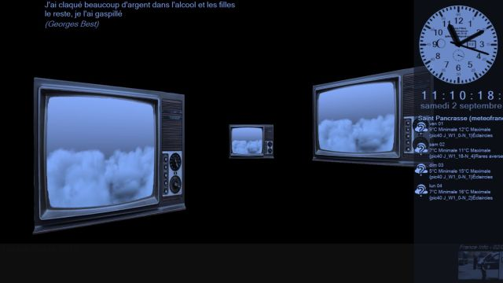
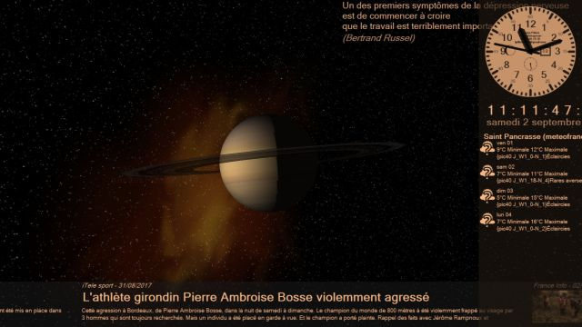
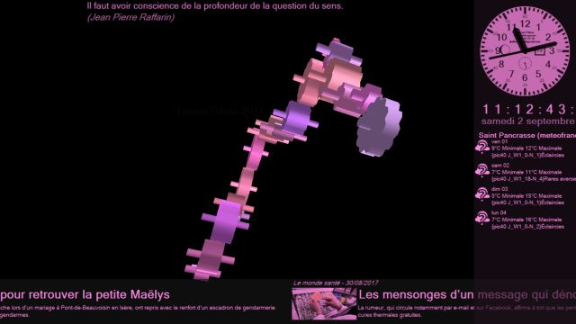
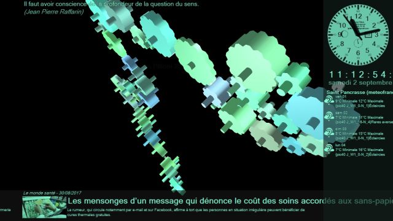
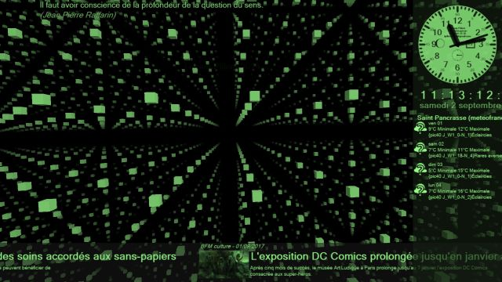
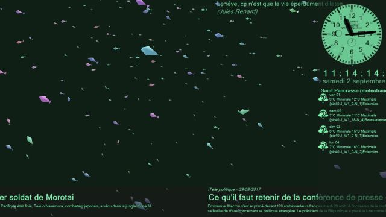
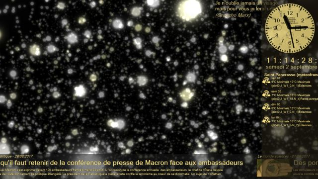
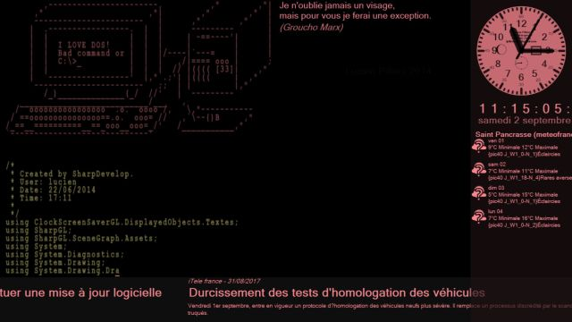
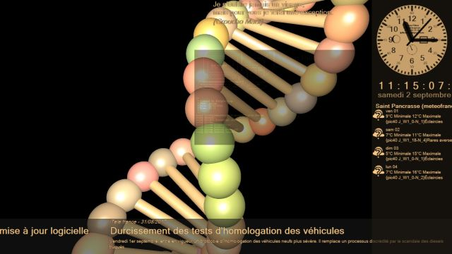
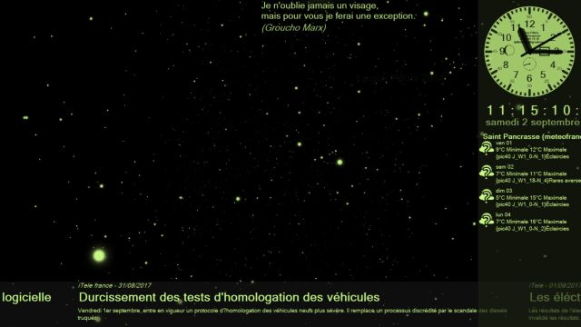
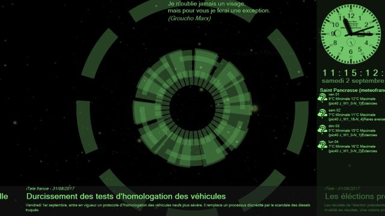
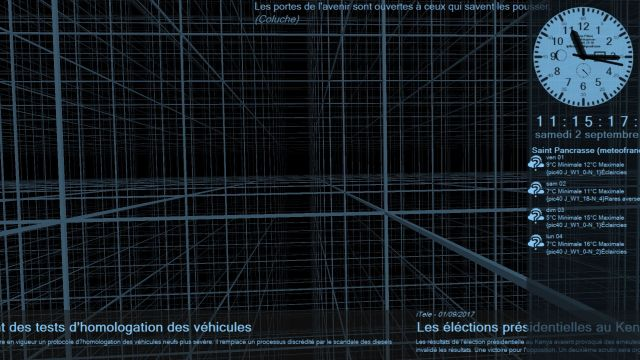
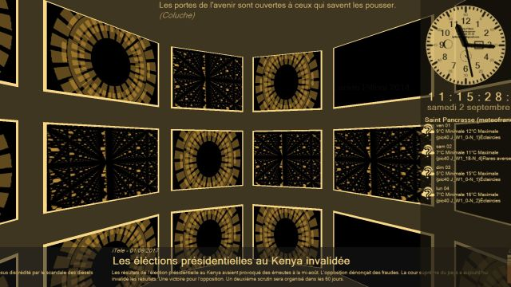
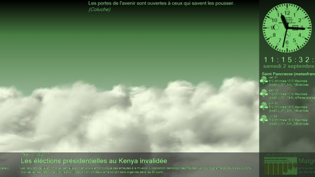
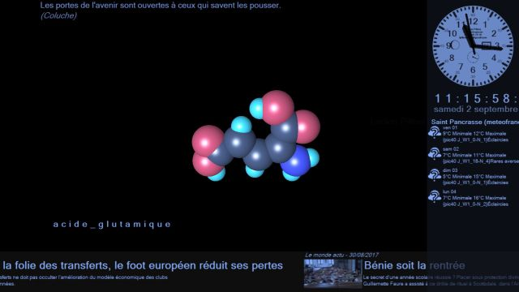
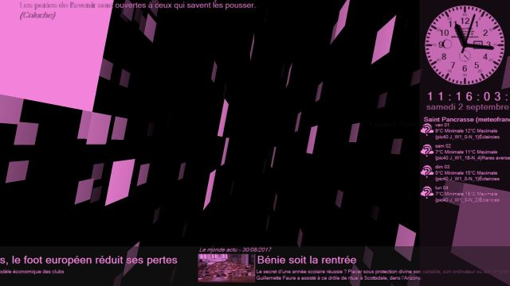
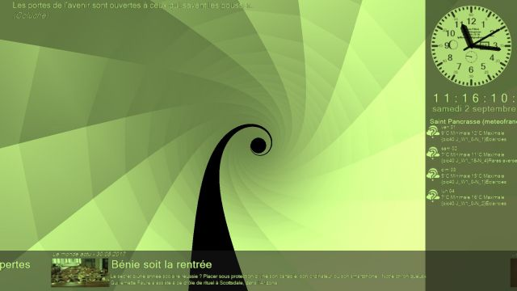
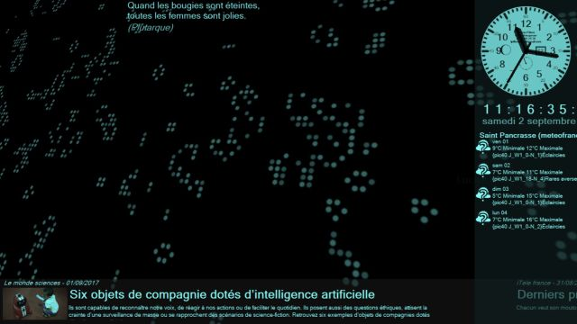
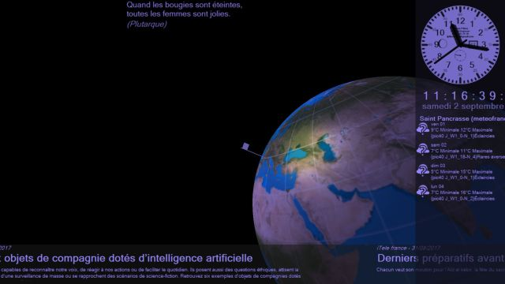
More...
